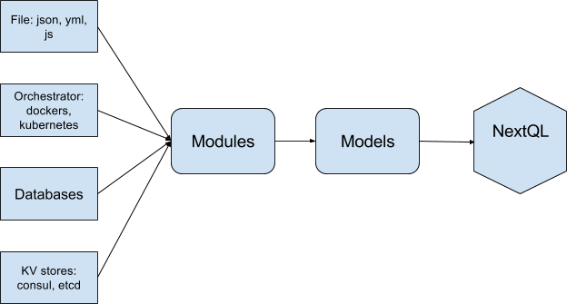

# nextql-configuration
NextQL plugin for complex model modular and distribution.

# Why?
In real life applications, number of models (or types) could be numerous. For example Github's GraphQL API have more than 150 types. ERP system like Odoo could have thousands models. NextQL-Configuration is a pattern to organize models into different modules and sources.

# Usage
```js
	const nextql = new NextQL();
	nextql.use(configurationPlugin);
	await nextql.configure({
		modules: [
			{
				loader: "json",
				source: path.resolve(__dirname, "./fixtures/json/*.json")
			}
		]
	});
```

# How?


## Modules
Module is a group of relevant models (or extension models).

```js
{
	"name": "Module A",
	"models": {
		"modelA": {
			"fields": {},
			"methods": {},
			"computed": {}
		},
		"modelB": {
			"fields": {},
			"methods": {},
			"computed": {}
		},
	},
	"dependencies": ["Module B"]
}
```
### Extension models
Module not only group relevant models, also extension models which defined in other modules. This is a useful pattern to organize complex relationship models.

For example: we have a User model which grouped into Base module

```js
{
	name: "base",
	models: {
		user: {
			fields: {
				name: 1
			},
			methods: {
				getById(){}
			}
		},
		group: {}
	}
}
``` 

Later we develop  Mail module which provide mail stuff for user 
```js
{
	name: "mail",
	models: {
		message: {//define model for single mail's message
			fields: { content: 1}
		}, 
		user: { // extend user model for mail features
			fields: {
				mailAddress: 1 // inject mailAddress field into above user model
			},
			methods: {
				getInbox(){} // inject getInbox method into above user model
			}
		}
	},
	dependencies: ["user"]
}
```
>Notice: to make sure module user loaded before module mail, module mail should define ```dependencies``` key.

Nextql query
```js
{
	user: {
		getById: {
			$params: {id: "giapnh" },
			name: 1,
			mailAddress: 1

		},
		getInbox: {
			$params: {id: "giapnh"},
			content: 1
		}
	}
}
```

## Sources/Loaders
Source is where modules configuration stored. Source could be:
- JSON, Js files
- Databases
- KV Store: consul, etcd
- Orchestrator: Dockers, Kubernetes
- Or anything as long as you write a loader for them.

```js
{
	modules: [
		{ // source configuration
			source: path.resolve(__dirname, "./fixtures/modules/*.js"),
			loader: "json" 
		},
		{
			source: "unix:///var/run/docker.sock",
			loader: "docker"
		},
		{
			source: "moduleCollection",
			loader: "mongodb"
		},
		resolveLoader: {
			paths: []
		}  
	]
}
```

Source configuration should consist a loader key to define name of source's loader. Rest of keys is parameters for the loader.

### Source's loader
Loader is simple nodejs function return a Promise which resolved when the loader complete load modules.
```js
function loader (modules, options) {
	return new Promise(function (ok, fail){
		// 1. load modules from databases, files, kv stores or rest api.
		// 2. update modules list.
		// 3. call ok() or fail()
		ok();
	});
}
```

### How nextql-configuration resolve loaders.
Nextql-configuration follow below order to resolve loaders
* resolveLoader.paths
* node_modules
* default loaders

### Default loaders
- json: Load json files based on source pattern. A module defined as a json file.
- js: Load js modules based on source pattern. A module defined as a js module.


# APIs
Next-configuration plugin inject 2 api into nextql object

## nextql.configuration:
Load all modules from sources. Build models from modules. Finally, load all models into nextql.
```js
nextql.configuration({ modules:[], resolveLoader: {}});
``` 

## nextql.reload
Reload all modules from sources, rebuild nextql's models. The method use to reload configure when module's sources changes
For example: after detect source's changes, we send SIGUSR2 signal tell nextql-configuration reload modules and rebuild models.
```js
process.on('SIGUSR2',function(){
	console.log("Received SIGUSR2");
	nextql.reload(); //reload all modules from sources and rebuild models
});
``` 


